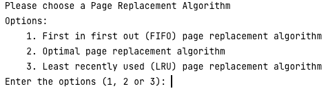

# CSC1007 Operating System

**Coursework 2022**

**Features Required:** 
Q1. KERNEL MODULE & C program to communicate 
Q2. C Program for Page Replacement Algorithm 

**Folder**
 KERNEL Folder
 Consist of Device Driver & User application to communicate between each other.

**MessageDev**
  - Loadable Kernel Module
  MessageClient.c
  - User Application to write message into kernel space / read message from kernel space

**PageReplacementApp**

Data Structure used for the app : LINKEDLIST

## Page Replacement Algorithm
Below is a screenshot of how the application looks like at start

## Additional Info

Screenshot of Results can be found in the wiki
